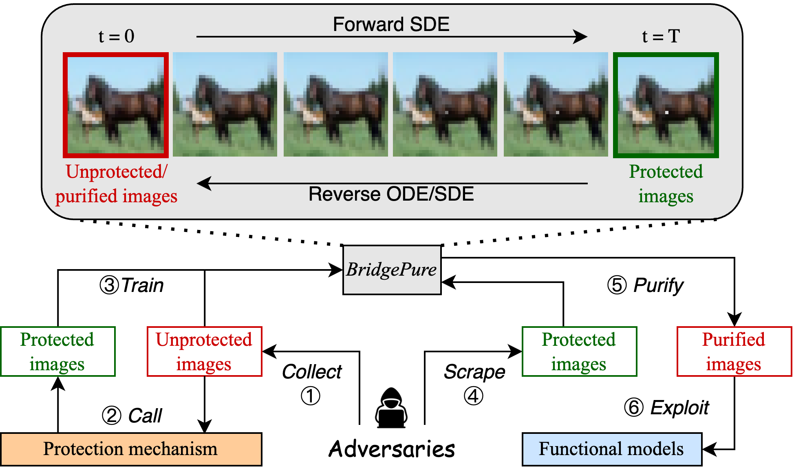

# BridgePure [NeurIPS 2025]

Official Implementation of NeurIPS 2025 paper [BridgePure: BridgePure: Limited Protection Leakage Can Break Black-Box Data Protection
](https://arxiv.org/abs/2412.21061). 

<p align="center">
  
</p>


# Dependencies

To install all packages in this codebase along with their dependencies, run
```# conda bridge environment
conda create -n bridge python=3.9.18
conda activate bridge
pip install -e .
```


# Quickstart
This repo supports two datasets: CIFAR-10 and CIFAR-100 with an availability attack LSP. We provide LSP perturbations on Google Drive [here](https://drive.google.com/drive/folders/1XIzlnIrs9Ufu5mar-SlHUl0Mudua7HUZ?usp=sharing). Please download and place them under `./data/` folder.

We provide quickstart scripts `examples/cifar10_lsp.sh` and `examples/cifar100_lsp.sh` to train and evaluate BridgePure on CIFAR-10 with LSP attack. You can run the script as follows:
```
bash examples/cifar10_lsp.sh

bash examples/cifar100_lsp.sh
```


# Aknowledgements
This code is mainly built upon the repository of [DDBM](https://github.com/alexzhou907/DDBM). 


# Citation

If you find this method and/or code useful, please consider citing

```bibtex
@article{wang2024bridgepure,
  title={BridgePure: Limited Protection Leakage Can Break Black-Box Data Protection},
  author={Wang, Yihan and Lu, Yiwei and Gao, Xiao-Shan and Kamath, Gautam and Yu, Yaoliang},
  journal={arXiv preprint arXiv:2412.21061},
  year={2024}
}
```
